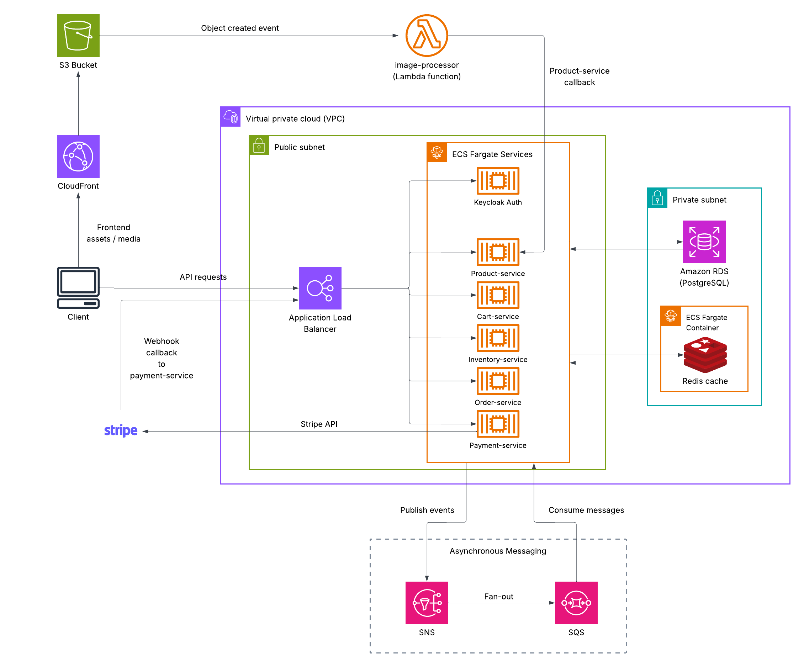
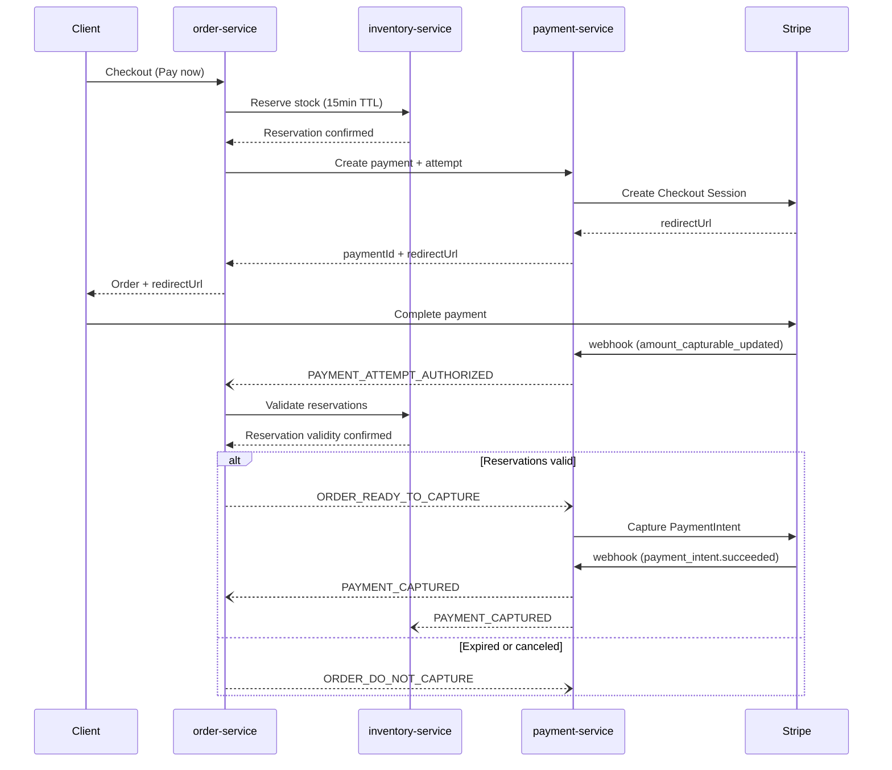
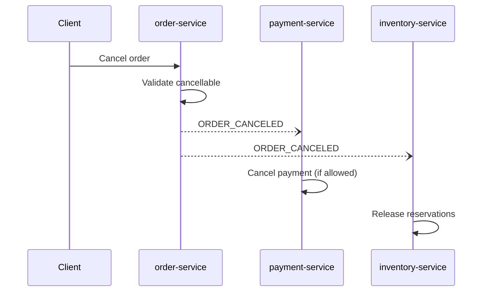
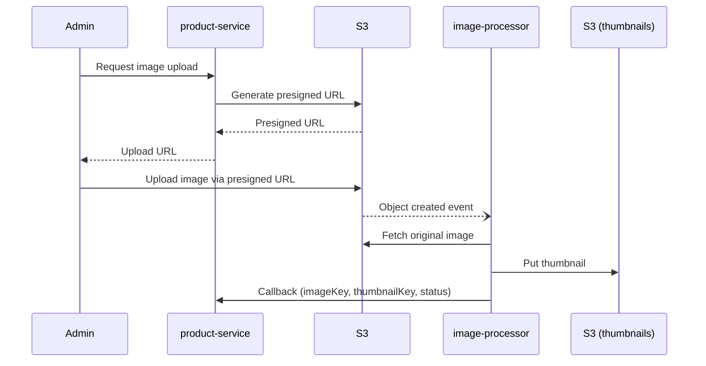

# Tender Chops

## Overview

Tender Chops is a distributed, event-driven e-commerce system built with Spring Boot and AWS (ECS, RDS, SNS/SQS, S3, Lambda, CloudFront), integrating Stripe for payments and Keycloak for authentication.

It implements a full commerce workflow — product catalog, cart, inventory reservation, order creation, and payment — with a focus on correctness under failure and concurrency.

### Key aspects of the system:

- **Payment workflow (Stripe + webhook + retry model)** — webhook events are used to confirm payment status; retry attempts tracked and deduplicated using webhook event IDs
- **Inventory reservation (TTL + safe capture window)** — reservations expire if payment isn't captured in time, preventing overselling under delayed or failed payment
- **SNS/SQS-backed event flow (outbox/inbox with idempotent consumers)** — replaces synchronous service calls with asynchronous messaging, enabling safe retries and deduplication
- **Asynchronous media pipeline (S3 → Lambda → CloudFront)** — presigned uploads to S3 trigger Lambda thumbnail generation, served via CloudFront

## Project Intent

This project demonstrates distributed systems design in a practical, end-to-end scenario. It focuses on handling failure modes that arise in real production systems — such as delayed payments, duplicate events, and cross-service consistency — using patterns like event-driven messaging, idempotent processing, webhook-driven state machines, and AWS-native infrastructure.

The goal is to design a system that remains correct and predictable under failure, rather than optimizing for feature completeness.

## Deployment Status

### Backend

- Fully migrated to AWS — ECS (Fargate), RDS (PostgreSQL), S3, SNS/SQS, CloudFront
- Complete order → reservation → payment → capture flow, testable via curl/Postman
- Media pipeline (S3 upload → Lambda processing → CloudFront delivery) also deployed
- **Currently spun down to minimize idle infrastructure cost.** Will be brought online once the cost optimization strategy and frontend demo are in place.

### Frontend (In Progress)

- Under active development
- API-first design — all workflows are exercisable without a UI

### Local Development

- Services run via Docker Compose
- Local services connect to AWS dev resources (S3, SNS, SQS)

### Cost Optimization Strategy (Planned)

- On-demand activation via frontend demo button
- Flow: API Gateway → Lambda → ECS scale (0 → 1) → EventBridge teardown after fixed window
- Goal: minimize idle infrastructure cost between demo sessions

## Architecture



**Diagram notes**

- This demo deployment places ECS services in public subnets to allow outbound internet access without NAT Gateway or VPC endpoint costs. Inbound access is restricted via security groups so that only the ALB can reach the services.
- Services currently share a single RDS instance and a shared Redis cache for cost efficiency during demo operation. In a production-oriented deployment, each service would typically own its own database, with dedicated caching only where needed.
- SNS/SQS is shown as a shared asynchronous messaging layer. In practice, multiple services publish and consume independently; the diagram intentionally abstracts those links to keep the overview readable.

## Tech Stack

### Frontend

- React (TypeScript)
- React Query (server state management)
- Zustand (client state management)
- Tailwind CSS (UI styling)
- Built with Vite
- Static hosting via AWS S3 + CloudFront

### Backend

- Java, Spring Boot
- Spring Data JPA (Hibernate)
- Redis (ECS-hosted, caching + projection reads)
- MapStruct (DTO mapping)

### Infrastructure

- AWS ECS (Fargate) — container orchestration (application services, Keycloak, Redis)
- AWS ALB — request routing
- AWS SNS/SQS — asynchronous messaging
- AWS S3 — object storage (media + static frontend hosting)
- AWS Lambda — asynchronous processing (image pipeline)
- AWS CloudFront — CDN for media delivery
- AWS RDS (PostgreSQL) — relational database
- AWS EventBridge — scheduled teardown (cost control)

### Authentication

- Keycloak (OAuth2 / OIDC)

### Payments

- Stripe (PaymentIntent + webhook-driven flow)

### Dev & Tooling

- Docker / Docker Compose (local development)

- GitHub Actions (CI/CD)

## System Flows

### Checkout & Payment Flow



1. Client calls `order-service` to initiate checkout.
2. `order-service` reserves stock via `inventory-service` (15-minute TTL).
3. On success, `order-service` creates the order (`PENDING_PAYMENT`).
4. `order-service` calls `payment-service` to create a payment (`PENDING`) and `paymentAttempt` (`PENDING_AUTH`).
5. `payment-service` creates a Stripe Checkout Session and returns `paymentId`, `paymentAttemptId`, and `redirectUrl`.
6. Client is redirected to Stripe to complete payment.
7. Stripe sends `payment_intent.amount_capturable_updated` webhook.
8. `payment-service` marks the attempt `AUTHORIZED` and publishes `PAYMENT_ATTEMPT_AUTHORIZED`.
9. `order-service` validates the order is still `PENDING_PAYMENT` and reservations are still valid.
10. `order-service` publishes:
    - `ORDER_READY_TO_CAPTURE` if valid, or
    - `ORDER_DO_NOT_CAPTURE` if expired or canceled.
11. `order-service` updates order status (`PROCESSING` or `EXPIRED`).
12. `payment-service` consumes the event:
    - `ORDER_READY_TO_CAPTURE` → captures the PaymentIntent
    - `ORDER_DO_NOT_CAPTURE` → cancels the payment
13. If capture succeeds, Stripe sends `payment_intent.succeeded` webhook.
14. `payment-service` updates attempt and payment to `CAPTURED` and publishes `PAYMENT_CAPTURED`.
15. `inventory-service` commits reservations.
16. `order-service` updates the order status to `PAID`.

### Order Cancellation



1. Client requests cancellation via `order-service`.
2. `order-service` verifies that the order is still cancellable and updates it to `CANCELED`.
3. `order-service` publishes `ORDER_CANCELED`.
4. `payment-service` consumes the event and cancels the payment if it is still cancellable.
5. `inventory-service` consumes the event and releases the reservations.

### Image Upload & Processing Pipeline



1. Admin requests an image upload via product-service.
2. product-service generates:
   - an image key and thumbnail key
   - a presigned S3 upload URL
3. The presigned URL is returned to the client.
4. Client uploads the image directly to S3 using the presigned URL.
5. S3 emits an object-created event that triggers the image-processor Lambda.
6. Lambda:
   - fetches the original image from S3
   - generates a thumbnail
   - uploads the thumbnail to the thumbnail bucket
7. Lambda calls back product-service to confirm processing results.

### Failure Handling

- Payment retries use new attempts. Each retry creates a new `paymentAttempt` with `attemptNo + 1`, expires the previous Checkout Session, and creates a new Checkout Session and PaymentIntent.
- Idempotency is enforced end-to-end. Each `paymentAttempt` has its own idempotency key reused for Stripe API calls, while cross-service events carry publisher-generated idempotency keys for inbox deduplication.
- Webhook deduplication is enforced at the database level. Stripe events are stored with a unique (`provider`, `event_id`) constraint to prevent duplicate processing.
- Reservation TTL protects against stale payments. A scheduled worker scans reservations and marks them `EXPIRED` when `expiresAt <= now()`.

## Key Design Decisions

### Modeling Payment Retries as Separate Attempts (One PaymentIntent per Attempt)

- **Problem**: Payment flows are unreliable — users may abandon checkout, retry payment, or trigger duplicate webhooks. Reusing the same PaymentIntent across retries makes it difficult to determine which attempt actually succeeded.
- **Decision**: Model each retry as a new `paymentAttempt`, with its own idempotency key and Stripe PaymentIntent. Each `paymentAttempt` maintains its own lifecycle (`PENDING_AUTH → AUTHORIZED → CAPTURED`), independent of the parent payment status.
- **Tradeoffs**: This introduces additional state management and requires careful mapping between Stripe webhooks and the correct attempt (webhook events are correlated to a specific `paymentAttempt` via the associated PaymentIntent ID). However, it removes ambiguity in retry scenarios and makes it straightforward to reason about which attempt succeeded and why — which is critical for correctness in payment systems.

### Time-Bounded Inventory Reservations with Capture-Time Validation

- **Problem**: Delayed or failed payments can leave inventory reserved indefinitely, leading to stale state and potential overselling.
- **Decision**: Use short-lived inventory reservations and validate their validity at payment authorization time before allowing capture.
- **Tradeoffs**: This requires coordination between order and inventory services and a background process to expire reservations. However, it ensures that only valid reservations are captured and prevents overselling under delayed or failed payment conditions.

### SNS/SQS as Transport with Application-Level Reliability

- **Problem**: Distributed systems must handle retries, duplicate messages, and partial failures. Relying solely on the messaging system for guarantees can obscure failure modes and limit control over correctness.
- **Decision**: Use SNS/SQS strictly as a transport layer, while implementing reliability semantics (idempotency, deduplication, retries) at the application level via outbox/inbox patterns.
- **Tradeoffs**: This requires every consumer to implement idempotent processing correctly, and mistakes can lead to duplicate effects leaking into business logic. However, it makes message handling explicit, easier to reason about, and independent of the underlying messaging provider.

### Direct-to-S3 Uploads (Bypassing the Backend)

- **Problem**: Routing image uploads through backend services increases latency and resource usage, especially for large files.
- **Decision**: Use presigned S3 URLs for direct client uploads, and process images asynchronously via a Lambda function.
- **Tradeoffs**: This introduces eventual consistency between upload and processing completion and requires callback coordination with the backend. However, it removes heavy I/O from application services and scales more effectively for media workloads.

### Public Subnet Deployment for Cost-Constrained Environments

- **Problem**: Running ECS services in private subnets with NAT Gateways and VPC endpoints significantly increases baseline cost, which is disproportionate for a demo-scale system.
- **Decision**: Deploy ECS services in public subnets with strict security group controls, avoiding NAT infrastructure while still restricting inbound access via ALB.
- **Tradeoffs**: This means services have public IPs and security depends entirely on correct security group configuration rather than network-level isolation. However, it reduces infrastructure cost and complexity, which is appropriate for a cost-conscious demo environment.

## Running the Project

> Local setup requires AWS credentials and external service configuration (Stripe, Keycloak, and optionally Lambda/ngrok for the image pipeline). Core checkout/payment flows can be tested without setting up the image-processing pipeline.

### Prerequisites

- Docker + Docker Compose
- AWS CLI installed and authenticated (`aws configure`)
- AWS credentials with access to S3, SNS, and SQS
- Stripe API keys
- Stripe CLI (for local webhook forwarding)
- (Optional) ngrok (or another tunnel / universal gateway) to expose the local product-service callback endpoint for Lambda
- (Optional) AWS Secrets Manager secret for the image-processing Lambda callback secret

### 1. Clone the repository

```bash
git clone https://github.com/kayc529/tender-chops-ecommerce.git
cd tender-chops
```

### 2. Configure environment variables

Each service reads its configuration from environment variables.

Copy the example file and fill in the required values:

```bash
cd infra/local
cp .env.example .env
```

Configure the required values for:

- database connection
- AWS credentials / resource names
- Stripe API keys
- Keycloak settings

### 3. Build all backend service images

From the project root:

```bash
./build-all.sh
```

This runs each service's `build.sh` script so all Docker images are built before starting the stack.

### 4. Start the local environment

From `infra/local`:

```bash
cd infra/local
docker compose up -d
```

Use `docker compose logs -f` to stream logs if needed.

### 5. Verify services are running

After startup, confirm that all containers are running:

```bash
docker ps
```

You should see all services up. Keycloak admin console should be available at `http://localhost:8080`.

### 6. Seed sample data

Populate the database with sample products and inventory data required for testing:

```bash
# Example (adjust container name if needed)
docker exec -i postgres psql -U <db_user> -d <db_name> < docs/sql/sample_seed_products.sql
docker exec -i postgres psql -U <db_user> -d <db_name> < docs/sql/sample_seed_inventory.sql
```

Alternately, you can use a database management tool like DBeaver to connect to the local database and run the seed scripts directly.

These scripts insert sample data into:

- `product`
- `product_stock`
- `inventory`

This step ensures the system has consistent data for testing checkout, payment, and image upload flows.

### 7. Forward Stripe webhooks

In a separate terminal:

```bash
stripe listen --forward-to http://localhost:8085/api/v1/webhooks/stripe
```

Use the signing secret provided by Stripe CLI in your local `payment-service` configuration.
If your local `payment-service` runs on a different port, update the forwarded webhook URL accordingly.

### 8. Configure Keycloak

å
Before testing the APIs:

1. Import the project realm into Keycloak from `docs/keycloak/`.
2. Verify the service clients are present (importing the realm should create them). The realm export creates the service clients but may not preserve client role assignments. You might need to manually assign the following client roles after import:
   - `product-service`: `inventory:internal:read`, `inventory:internal:create`
   - `cart-service`: `inventory:internal:read`, `products:internal:read`
   - `order-service`: `cart:internal:write`, `cart:internal:read`, `inventory:internal:release`, `inventory:internal:reserve`, `payment:internal:create`, `products:internal:read`
3. Create test users, including an admin user with realm role `ADMIN`.

### 9. Test the core checkout flow

Import the provided Postman assets for easier API testing:

- `docs/postman/*.postman_collection.json`
- `docs/postman/*.postman_environment.json`

Typical test flow:

1. Authenticate with Keycloak and obtain a token
2. Create / populate a cart
3. Create a quote
4. Call the order creation endpoint
5. Follow the returned Stripe `redirectUrl`
6. Complete payment in Stripe test mode

### Optional: Image pipeline setup

The following steps are only required to test the image upload and thumbnail generation flow.

#### 10. Expose the product-service callback for Lambda

The image-processing Lambda needs a publicly reachable callback URL to notify `product-service` after thumbnail generation.

Expose your local product-service with ngrok (or a similar tunnel) and use the generated public URL in your local configuration:

```bash
ngrok http 8081
```

Use the resulting public URL for the Lambda callback target configured in AWS. Set this public URL as `PRODUCT_SERVICE_BASE_URL` in your Lambda environment variables on AWS.

#### 11. Build and deploy the image-processing Lambda

The repository includes helper scripts for packaging and deploying the image-processing Lambda.

From `infra/lambda/image-processor`:

```bash
npm run build
```

This installs the Lambda dependencies in a Docker-compatible environment and produces `function.zip`.

Configure the following environment variables directly in your Lambda function settings in AWS:

- `PRODUCT_IMAGE_CALLBACK_SECRET_NAME`
- `PRODUCT_SERVICE_BASE_URL`
- `THUMBNAIL_BUCKET_NAME`
- `THUMBNAIL_SIZE_WIDTH`

To deploy the packaged Lambda code:

```bash
npm run deploy
```

This assumes you already created a Lambda function named `image-processor` in AWS.

You also need to create the callback secret in AWS Secrets Manager so the Lambda can authenticate its callback to `product-service`.

#### 12. Test the image upload flow

1. Request an image upload URL from `product-service`
2. Upload a sample image to S3 using the presigned URL (see `docs/sample-data/images`)
3. Verify that the image-processing Lambda generates the thumbnail and calls back `product-service`

### Notes

- Keycloak realm export is included in `docs/keycloak/`
- Postman collections and environment files are available in `docs/postman/`
- Local services connect to AWS resources for S3, SNS, and SQS integration
- Cloud deployment is intentionally spun down when not in use (see Deployment Status)

## Production Considerations

### Availability & Scalability

- Multi-AZ deployment for ECS services and RDS (currently single-AZ to minimize cost)
- ECS service auto-scaling based on SQS queue depth and ALB request count

### Reliability & Messaging

- Dead-letter queues (DLQs) on payment and inventory SQS queues to isolate poison messages from blocking processing
- Event schema versioning to allow services to evolve independently without breaking consumers

### Observability

- Distributed tracing across the order → reservation → payment → capture flow (for example, AWS X-Ray)
- Alerting on payment webhook delivery failures and reservation expiry rates

## License

This project is licensed under the [MIT License](LICENSE).
